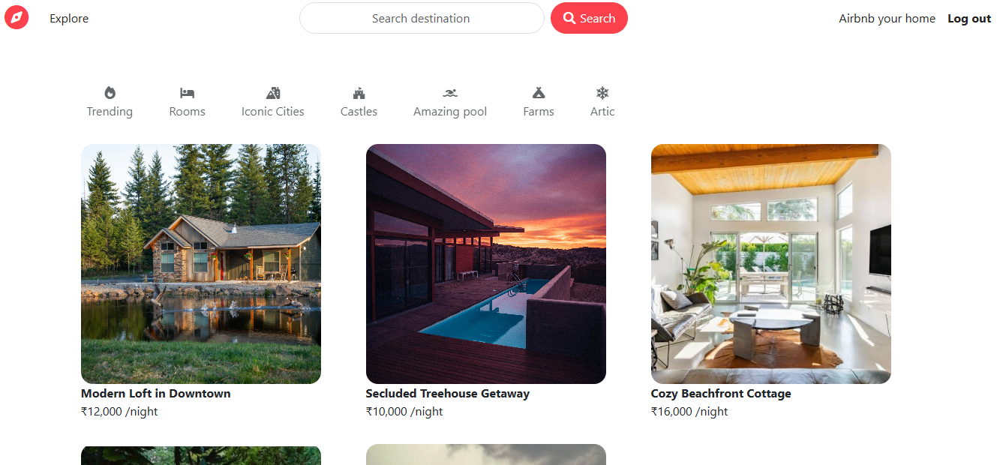
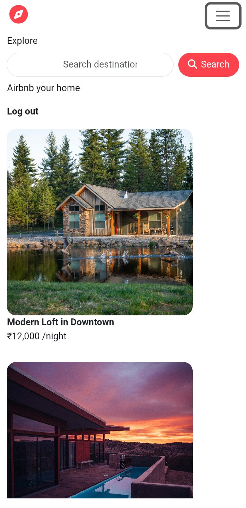
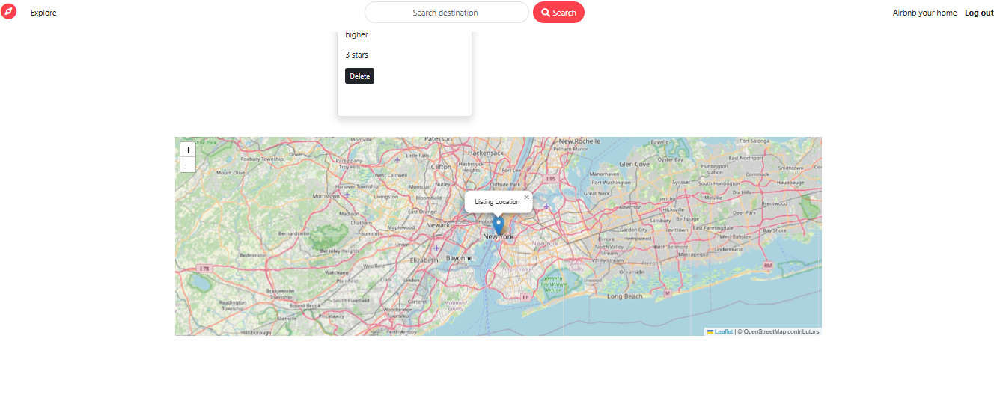
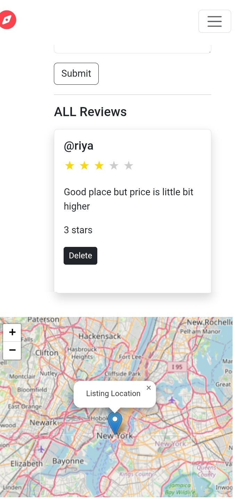
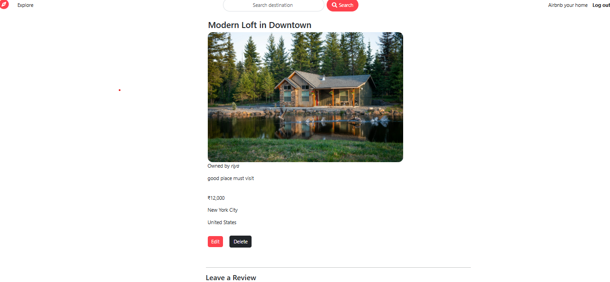
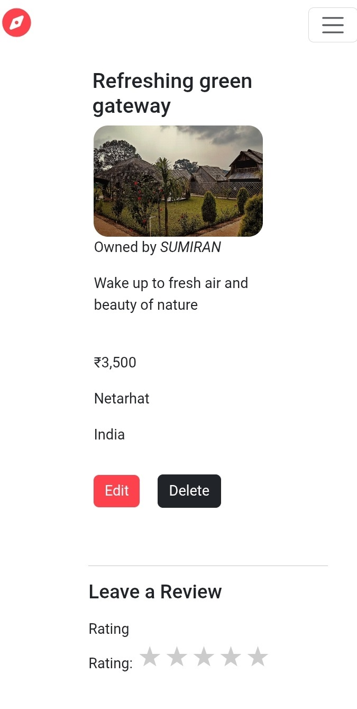
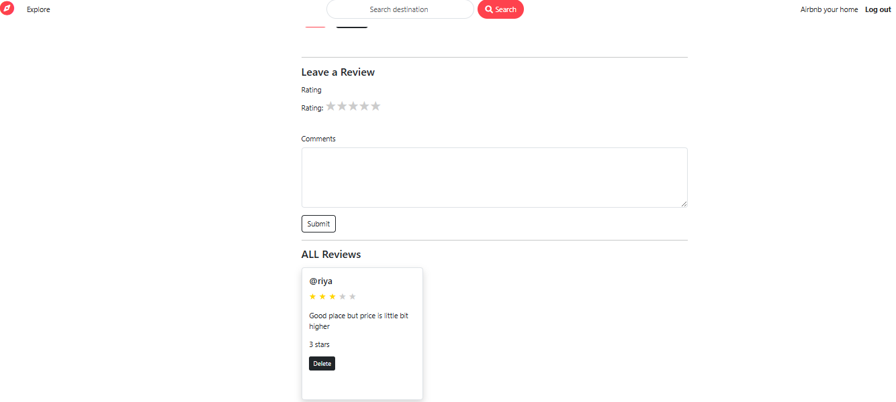

 🌍 Wanderlust – Airbnb Clone

## 📌 Description
**Wanderlust** is a full-stack web application inspired by Airbnb, designed to help users explore, create, and manage property listings.

Users can browse accommodations, create and manage their own listings, leave reviews with star ratings, and view property locations through interactive maps.

This project showcases strong full-stack development skills, including authentication, authorization, CRUD operations, RESTful routing, and cloud-based integrations.

🔗 Live Demo:
👉 https://majorproject-1fzy.onrender.com

## ✨ Features

### 🔐 User Authentication
- Secure Signup, Login, and Logout functionality

### 🛡️ Authorization
- Only listing owners can edit or delete their listings

### 🏠 Listings Management
- Full CRUD operations for property listings

### ⭐ Review System
- Add, edit, and delete reviews with star ratings

### 🔍 Search Functionality
- Easily search for listings by keywords

### 🗺️ Map Integration
- Interactive maps displaying property locations

### ☁️ Cloud Image Uploads
- Secure image storage using Cloudinary

### 📱 Responsive Design
- Optimized for desktop and mobile devices

### 🧩 MVC Architecture
- Clean and scalable code structure

---

## 🛠️ Tech Stack

### 🎨 Frontend
- HTML5
- CSS3
- Bootstrap
- JavaScript
- EJS (Embedded JavaScript Templates)

### ⚙️ Backend
- Node.js
- Express.js

### 🗄️ Database
- MongoDB Atlas (Cloud Database)
- Mongoose ODM

### 🔐 Authentication & Authorization
- Passport.js
- Express-Session
- Connect-Mongo

### ☁️ Cloud Services & APIs
- Cloudinary – Image Upload and Storage
- MapTiler / Mapbox – Map Integration
- MongoDB Atlas – Cloud Database Hosting

### 🧰 Other Tools
- Multer – File Uploads
- Dotenv – Environment Variables
- Git & GitHub – Version Control
- Render / Railway – Deployment Platforms

---

## 📸 Screenshots

### 🏠 Home Page
#### Desktop View
[](./images/home-desktop.png)

#### Mobile View
[](./images/home-mobile.jpg)

### 🗺️ Map Page
#### Desktop View
[](./images/map-desktop.png)

#### Mobile View
[](./images/map-mobile.jpg)

### 🔍 View Page
#### Desktop View
[](./images/view-desktop.png)

#### Mobile View
[](./images/view-mobile.jpg)

### ⭐ Leave Review
[](./images/leave-review.png)
## ⚙️ Installation

Follow these steps to run the project locally:

### 1️⃣ Clone the Repository
```bash
git clone https://github.com/your-username/wanderlust.git
cd your -repo
```
2️⃣ Install Dependencies
```bash
npm install
```
###3️⃣ Configure Environment Variables
Create a .env file in the root directory and add the following:

# MongoDB Atlas Connection
ATLASDB_URL=your_mongodb_atlas_connection_string

# Session Secret
SECRET=your_session_secret

# Cloudinary Configuration
CLOUDINARY_CLOUD_NAME=your_cloud_name
CLOUDINARY_KEY=your_cloudinary_key
CLOUDINARY_SECRET=your_cloudinary_secret

# Map API Token (MapTiler or Mapbox)
MAP_TOKEN=your_map_api_token


4️⃣Run the Application
```bash
node app.js
```
Or, using Nodemon:nodemon app.js


5️⃣ Access the Application

## Run locally

After starting the server

Open your browser and visit:
http://localhost:8080/listing


wanderlust/
│── models/

│── routes/

│── controllers/

│── views/

│── public/

│── utils/

│── images/

│── app.js

│── cloudConfig.js

│── schema.js

│── package.json

│── .env


🚀 Future Enhancements

-Payment gateway integration
-Booking system
-Wishlist feature
-Advanced filters and sorting
-User profile management


👨‍💻 Author
Kumar Sumiran

🔗 GitHub: https://github.com/kumarsumiran152-ai

🔗 LinkedIn: https://www.linkedin.com/in/kumar-sumiran-6815a4327?
utm_source=share&utm_campaign=share_via&utm_content=profile&utm_medium=android_app

📧 Email:kumarsumiran152@gmail.com
